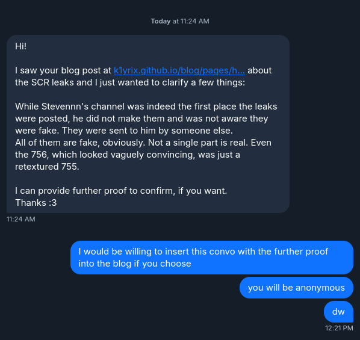
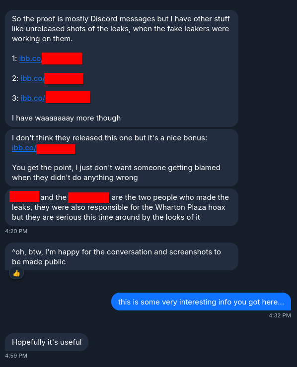
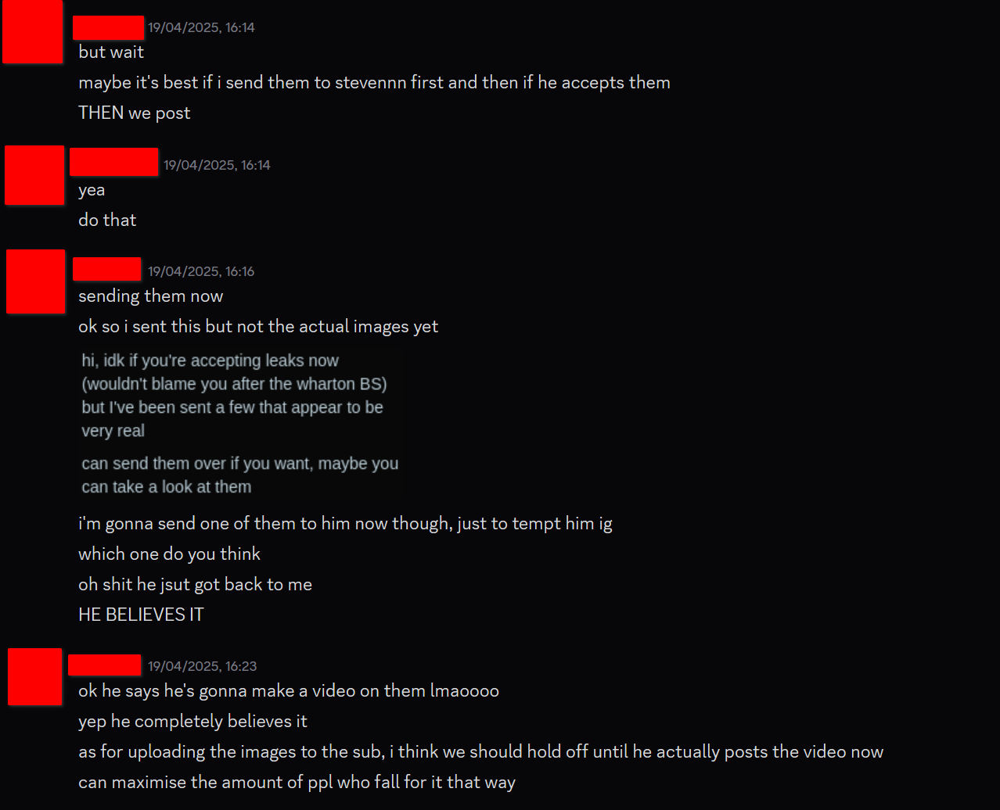
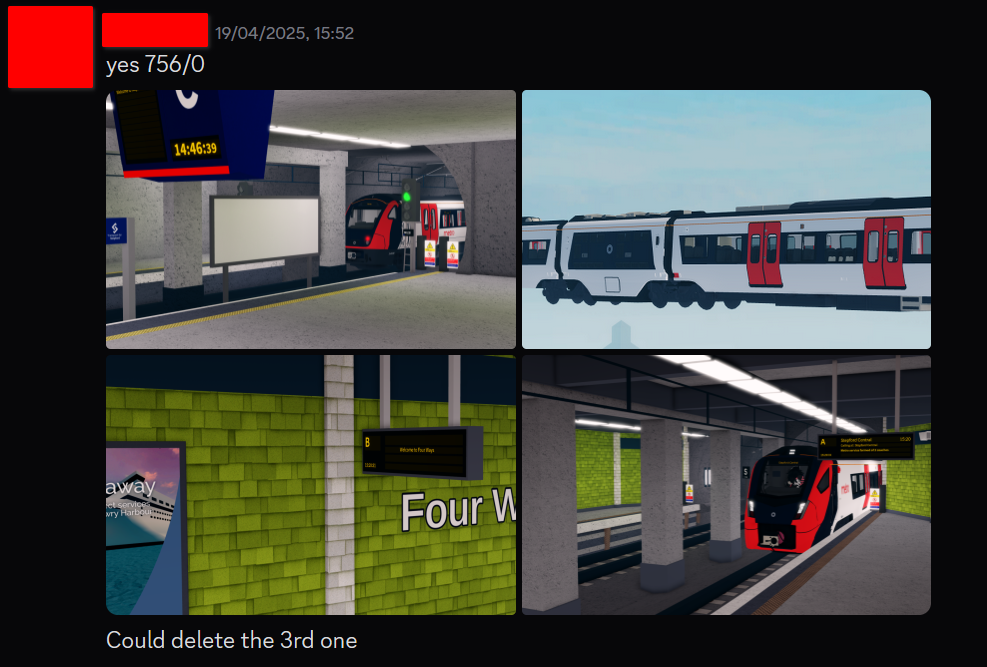
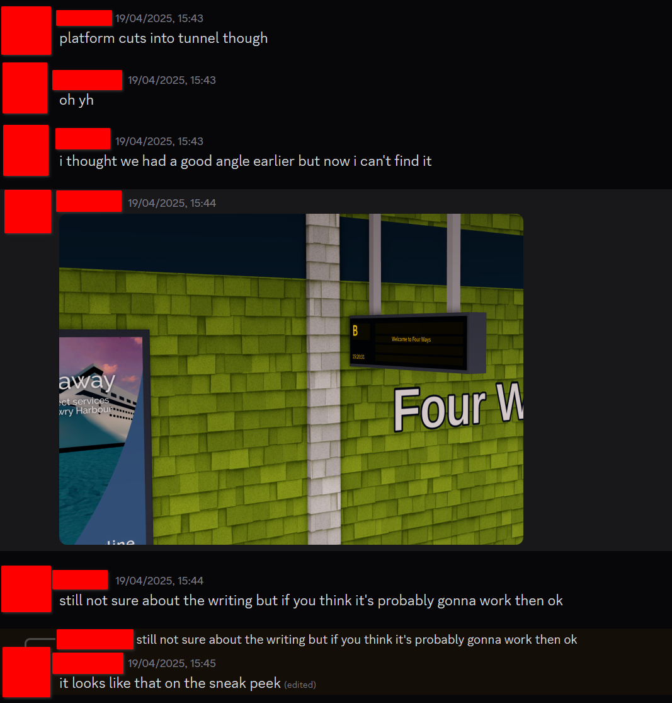
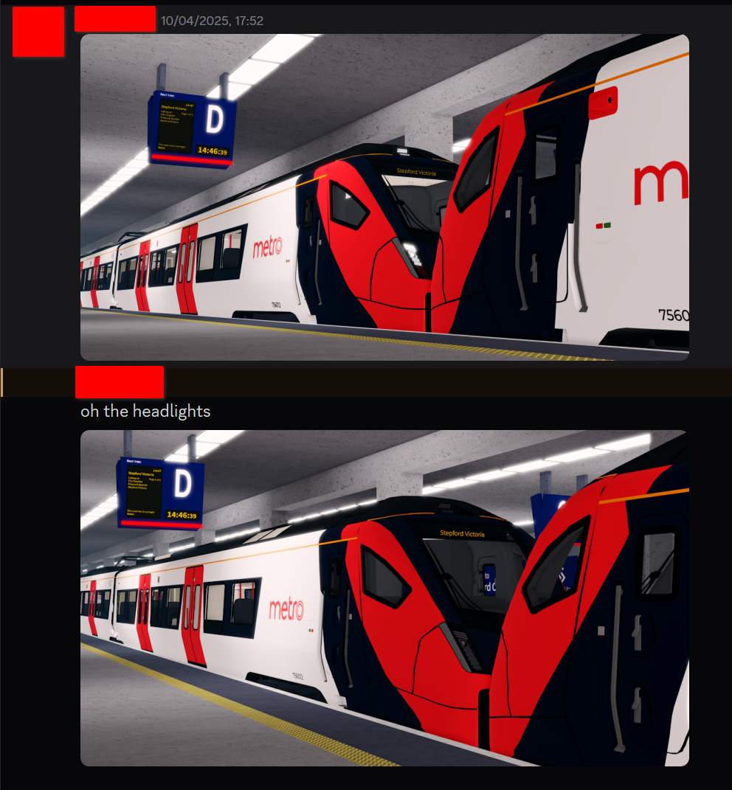

# I am pissed. (update)
published 2025, 5th November @ 17:36 EST. (UTC-5)

---

## I got an update.

I have an update on a blog post that I made many back in april. the blog post in question was the ["I am pissed"](b1) post where I rant on how a small content creator leveraged (in my belief) the use of my highly-accurate redrawn metro logo, specifically designed for the SCR Wiki, in order to create fake leaks. while I didn't pursue action, considering my knowledge on copyright law, I was still really angry over this regardless. I have gotten over it, but now this topic was brought back to my attention recently.

## what's going on?

an anonymous user on [my bluesky](bsky1) (go follow btw) sent me a private message. apparently stevennn was not the one behind the fake leaks. (*and because of that, I would like to sincerely apologize for the accusation made in the previous blog post*) it turned out that two random guys decide to make the fake leaks (I suspect using all the highest quality assets possible through a mix of references, leaked models, and the SCR Wiki) and then sent the fake leaks to stevennn, in which stevennn believed in the leaks to make content out of it. they were allegedly also the ones behind the great wharton plaza hoax leaks as well.

## the evidence

**to maintain privacy of everyone, all mentions of names will be censored. I will also not reveal who sent me this information to protect their identity.**

 
figure A1: the conversation with the whistleblower on my bluesky dms

 
figure A2: the conversation with the whistleblower on my bluesky dms

 
figure B1: the two guys sending stevennn the fake leaks, acknowledging that stevennn believed in the fake leaks

 
figure B2: one of the guys showing the fake leaks so far

 
figure B3: the guys discussing about a fake leak about four ways

 
figure B4: one of the guys showing a fake leak featuring the Class 756

regardless, these are the most believable fake leaks that the community has probably seen and probably would've gotten away with it if it wasn't for those very noticable errors in those fake leaks. at least these new evidence definitely shows that they were infact staged.

[b1]: ../iAmPissed_2025-04-19/
[bsky1]: https://k1yrix.and.cat/